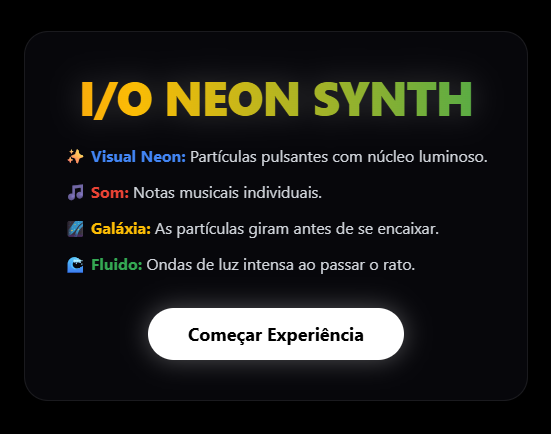
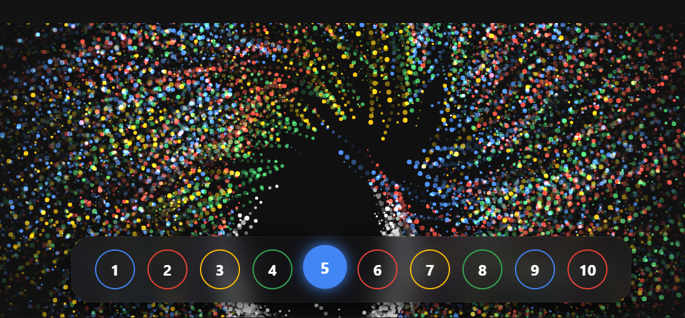
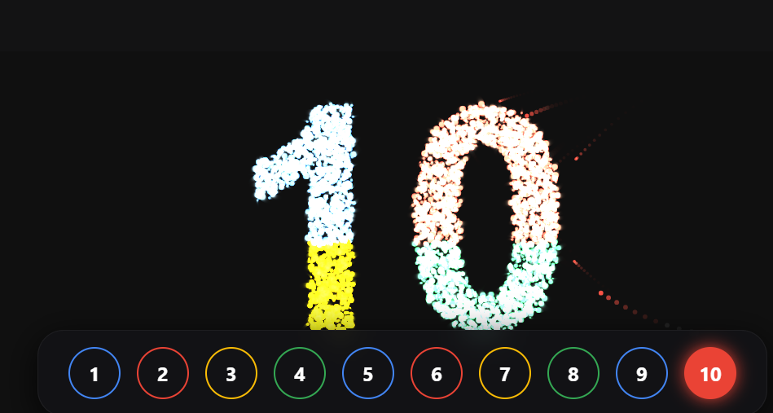

# 🧪 Sintetizador de Fluido Numérico Interativo

# 🧪 Sintetizador de Fluido Numérico Interativo

Vídeo: https://github.com/user-attachments/assets/10feb3ad-f9c9-44fe-acf2-868c306e9638

Um experimento interativo e áudio-visual criado com JavaScript puro e HTML5 Canvas. A aplicação combina a renderização visual de alta performance com a síntese de áudio nativa do navegador (Web Audio API), customizada com a paleta de cores e identidade visual do **Google I/O**.

## 📸 Galeria Visual







## ✨ Funcionalidades e Modos de Interação

A física matemática foi configurada para criar quatro comportamentos dinâmicos distintos:

* 🌌 **Modo Galáxia:** Ao trocar de número, as partículas giram numa espiral muito rápida antes de se alinharem na nova forma.

* 🌊 **Modo Fluido:** Passar o rato (ou o dedo) sobre as partículas cria uma onda de luz e repele as partículas suavemente.

* 🎉 **Modo Celebração:** Um clique no fundo escuro dispara uma "onda de choque" mecânica de alta potência, dispersando as partículas de forma agressiva com um efeito sonoro de sweep (explosão).

* 🎵 **Sintetizador Integrado:** Cada número está mapeado para uma nota de uma Escala Pentatónica. O áudio reage instantaneamente sem atrasar a animação.

## 🛠️ Detalhes Técnicos

* **Motor Visual (Canvas):** Renderiza **4.500 partículas** simultaneamente a 60 FPS para garantir uma densidade sólida e vibrante. As partículas são divididas em 4 quadrantes para assumir as cores oficiais (Azul, Vermelho, Amarelo e Verde).

* **Alta Performance:** Utiliza uma "grelha virtual" interna e matemática otimizada para garantir a formação dos números sem atrasos e sem bloqueios de processador, independentemente da resolução do ecrã.

* **Motor de Áudio:** Sintetizador construído do zero com a Web Audio API (osciladores `sine` e `sawtooth` e envelopes ADSR ultrarrápidos).

* **Interface (UI):** Construída com Tailwind CSS utilizando o estilo *Glassmorphism* (fundo translúcido com desfoque).

## 🚀 Como correr o projeto localmente

Como o projeto não utiliza dependências ou frameworks complexos de build, executá-lo é extremamente simples:

1. Clone este repositório:

   ```bash
   git clone [https://github.com/Macelo2020/sintetizador-de-fluido-numerico-interativo.git](https://github.com/Macelo2020/sintetizador-de-fluido-numerico-interativo.git)
